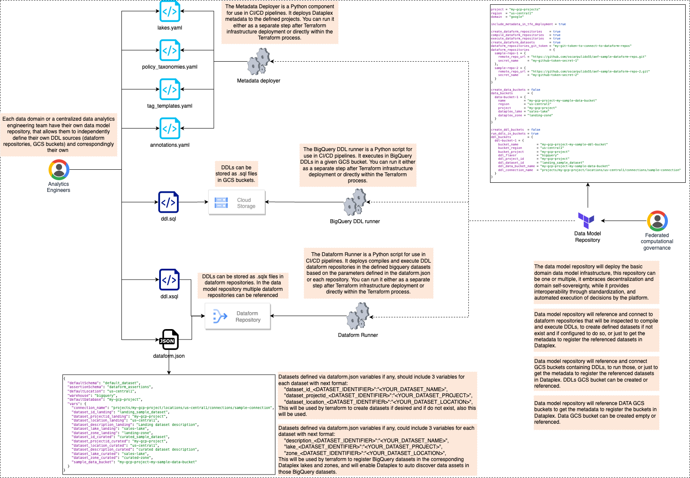

# Analytics Engineering Framework - Data Model
[Analytics engineers](https://www.getdbt.com/what-is-analytics-engineering) transform, test, deploy, and document data using software engineering principles, providing clean datasets that empower end-users to independently answer their own questions.

### Concepts
This reference Data Model management repository is your central hub for streamlined data model definition. It deploys dataform repositories and integrates with BigQuery metadata and [Dataplex](https://cloud.google.com/dataplex) to enable data governance, discoverability, and access control. Here's what it offers:
  - Creates or references Dataform repositories form given [third-party Git repositories](https://cloud.google.com/dataform/docs/connect-repository).
  - Creates or references BigQuery datasets based on given parameters or the variables you have in the [dataform settings files](https://cloud.google.com/dataform/docs/configure-dataform) like `dataform.json` you have in Dataform repositories.
  - Creates or references GCS buckets containing DDLs.
  - Creates or references GCS data buckets.
  - Creates Dataplex lakes and zones and register data assets (GCS buckets or BigQuery Datasets) accordingly based on given parameters.
  - Defines tag templates, policy taxonomies, governance rules and annotations to be applied to data assets based on given [parameter files](https://github.com/GoogleCloudPlatform/cortex-data-foundation/tree/main/docs/data_mesh#understanding-the-base-resource-specs).



## Usage
While this repository can be used to keep track of your data model and metadata, the provided terraform code can be used to control deployment or just to reference it, so you can deploy it as another step in your CI/CD pipeline. 
### 1. Terraform:
Define your terraform variables.  We recommend creating a `.tfvars` file.
<!-- BEGIN TFDTFOC -->
| name                                       | description                                                                                                                                                                                                   | type                                               | required | default |
|--------------------------------------------|---------------------------------------------------------------------------------------------------------------------------------------------------------------------------------------------------------------|----------------------------------------------------|----------|---------|
| [project](variables.tf#L104)               | Project where the dataform repositories, the Dataplex metadata, and other base resources will be created.                                                                                                    | string                                                 | true     | -       |
| [region](variables.tf#L108)                | Region where the datasets, dataform repositories, Dataplex metadata, and other base resources will be created.                                                                                              | string                                                 | true     | -       |
| [domain](variables.tf#L100)                | Your organization or domain name (organization for centralized data management, domain name for a Data Mesh environment).                                                                                     | string                                                 | true     | -       |
| [include_metadata_in_tfe_deployment](variables.tf#L4) | Controls whether metadata is deployed alongside Terraform resources (if false, metadata can be deployed separately in a CI/CD pipeline).                                                                       | bool                                                   | false    | -       |
| [create_dataform_datasets](variables.tf#L7)       | Controls whether datasets defined in dataform.json files are created (if false, they should be created manually or via a separate CI/CD step).                                                              | bool                                                   | false    | -       |
| [create_dataform_repositories](variables.tf#L10)  | Controls whether dataform repositories are created (if false, should be created as a separate step).                                                                                                       | bool                                                   | false    | -       |
| [compile_dataform_repositories](variables.tf#L13) | Controls whether dataform repositories are compiled alongside Terraform resources (if false, should be compiled as a separate step).                                                                           | bool                                                   | false    | -       |
| [execute_dataform_repositories](variables.tf#L16) | Controls whether dataform repositories are executed (if false, should be executed as a separate step).                                                                                                      | bool                                                   | false    | -       |
| [dataform_repositories](variables.tf#L112)         | Dataform repository remote settings for attaching to a remote repository.                                                                                                                                 | map(object({...}))                                     | false    | {}      |
| [dataform_repositories_git_token](variables.tf#L121) | Git token to access the dataform repositories (stored in Secret Manager, used for reading dataform.json files).                                                                                           | string (sensitive)                                     | true     | -       |
| [create_data_buckets](variables.tf#L126)  | Controls whether referenced data buckets will be created (if false, buckets should already exist).                                                                                                          | bool                                                   | false    | -       |
| [data_buckets](variables.tf#L131)         | Data buckets configuration.                                                                                                                                                                           | map(object({...}))                                     | false    | {}      |
| [create_ddl_buckets](variables.tf#L136)   | Controls whether buckets containing DDLs will be created (if false, buckets should already exist).                                                                                                       | bool                                                   | false    | -       | 
| [run_ddls_in_buckets](variables.tf#L139)  | Controls whether .sql files in DDL buckets are executed on deployment.                                                                                                                                  | bool                                                   | false    | -       |
| [ddl_buckets](variables.tf#L142)          | Buckets containing .sql DDL scripts to execute on Terraform deployment.                                                                                                                                   | map(object({...}))                                     | false    | {}      |
<!-- END TFDOC -->

#### Example:

```hcl
    project = "your-project-id"
    region  = "us-central1"
    domain  = "google"
    
    include_metadata_in_tfe_deployment = true
    
    create_dataform_repositories    = true
    compile_dataform_repositories   = true
    execute_dataform_repositories   = true
    create_dataform_datasets        = true
    dataform_repositories_git_token = "your-git-token-to-connect-to-your-git-repos"
    dataform_repositories           = {
      sample-repo-1 = {
        remote_repo_url = "https://github.com/../your-git-repo1.git"
        secret_name     = "any-name"
      },
      ...
    }
    
    create_data_buckets = false
    data_buckets        = {
      data-bucket-1 = {
        name          = "your-data-bucket"
        region        = "us-central1"
        project       = "bucket-project-id"
        dataplex_lake = "sales-lake"
        dataplex_zone = "landing-zone"
      },
      ...
    }
    
    create_ddl_buckets  = false
    run_ddls_in_buckets = true
    ddl_buckets         = {
      ddl-bucket-1 = {
        bucket_name          = "your-ddl-bucket"
        bucket_region        = "us-central1"
        bucket_project       = "bucket-project-id"
        ddl_flavor           = "bigquery"
        ddl_project_id       = "ddls-project-id-if-any"
        ddl_dataset_id       = "ddls-dataset-id-if-any"
        ddl_data_bucket_name = "ddls-bucket-name-if-any"
        ddl_connection_name  = "projects/connection-project/locations/us-central1/connections/ddls-connection-name-if-any"
      }
    }
```

### 2. Dataplex:
   - Familiarize yourself with [this](https://github.com/GoogleCloudPlatform/cortex-data-foundation/tree/main/docs/data_mesh#concepts) concepts.
   - Define metadata in the following `.yaml` files:
     - [Asset Annotations](https://github.com/GoogleCloudPlatform/cortex-data-foundation/tree/main/docs/data_mesh#asset-annotations)
     - [Dataplex Lakes, Zones, and Assets](https://github.com/GoogleCloudPlatform/cortex-data-foundation/tree/main/docs/data_mesh#dataplex-lakes-zones-and-assets)
     - [Policy Taxonomies and Tags](https://github.com/GoogleCloudPlatform/cortex-data-foundation/tree/main/docs/data_mesh#policy-taxonomies-and-tags)
     - [Data Catalog Tag Templates](https://github.com/GoogleCloudPlatform/cortex-data-foundation/tree/main/docs/data_mesh#catalog-tag-templates)
```
└── metadata
│   ├── annotations
│   │   └── annotations.yaml
│   ├── lakes
│   │   └── lakes.yaml
│   ├── policy_taxonomies
│   │   └── policy_taxonomies.yaml
│   └── tag_templates
│       └── tag_templates.yaml
```

### 3. Run the Terraform Plan / Apply using the variables you define in the first step.
```bash
terraform plan -var-file="my-vars.tfvars"
```

## Integration with the Analytics Engineering Framework

This opinionated Data Model management repository is designed as a component of a comprehensive Analytics Engineering Framework comprised of:

1. Analytics Engineering Framework - Data Orchestration: Automates the generation of Google Cloud Workflows Definition files.
1. Analytics Engineering Framework - Orchestration Framework: Seamlessly deploy your orchestration infrastructure.
1. Analytics Engineering Framework - Data Transformation: Houses your data transformation logic.
1. Analytics Engineering Framework - Data Model: Manages data models, schemas and Dataplex lakes and zones.